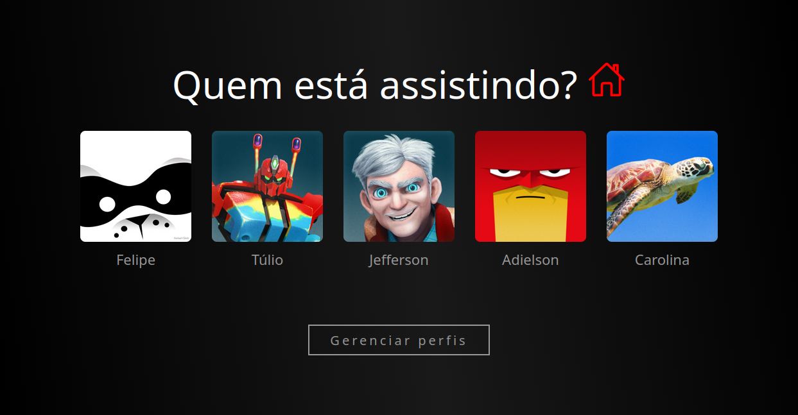

# 🎬 NetIFAL - Netflix Clone


> Projeto desenvolvido para as disciplinas de **Programação Web (PWeb)** e **Programação Orientada a Objetos (POO)** do **Instituto Federal de Alagoas (IFAL)**.

---

## 🖼️ Preview

<div align="center">
  
</div>

---

## 🚀 Sobre o Projeto

O **NetIFAL** é uma aplicação Single Page Application (SPA) que simula a interface da Netflix. O projeto foca na componentização do React para criar uma interface modular e reutilizável, consumindo dados reais de filmes através da API do TMDB (The Movie Database).

### 🎯 Funcionalidades Implementadas

* **🎬 Catálogo Dinâmico:** Consumo da API do TMDB para listar filmes "Melhor Avaliados" e tendências.
* **👤 Simulação de Perfis:** Tela inicial para seleção de usuário (Felipe, Túlio, Jefferson, etc.), demonstrando gerenciamento de estado e rotas.
* **🔄 Navegação SPA:** Uso do `react-router-dom` para navegar entre Home, Conta e Seleção de Perfil sem recarregar a página.
* **🎨 Componentes Reutilizáveis:**
    * `CarrosselSimples` e `CarrosselNumerado` para listagem de filmes.
    * `BarraDeNavegacao` e `MenuLateral` para estrutura de layout.
    * `CardPerfil` para exibição de usuários.

---

## 🛠️ Tecnologias

* **[React](https://react.dev/):** Biblioteca principal para construção da UI.
* **[Vite](https://vitejs.dev/):** Build tool para desenvolvimento rápido.
* **[React Router Dom](https://reactrouter.com/):** Gerenciamento de rotas (v7).
* **[React Icons](https://react-icons.github.io/react-icons/):** Biblioteca de ícones (Fa, Go, Bs, etc.).
* **CSS Modules/Puro:** Estilização customizada para cada componente.
* **API:** [The Movie Database (TMDB)](https://www.themoviedb.org/documentation/api).

---

## 📂 Estrutura do Projeto

O projeto segue uma arquitetura baseada em componentes funcionais:

```bash
src/
├── 📂 assets/          # Imagens locais (Logos, avatares, ícones)
├── 📂 components/      # Componentes reutilizáveis (Botões, Menus, Cards)
│   ├── Atalhos.jsx
│   ├── BarraDeNavegacao.jsx
│   ├── CardPerfil.jsx
│   ├── CarrosselNumerado.jsx
│   └── ...
├── 📂 pages/           # Páginas principais da aplicação
│   ├── PageConta.jsx            # Área administrativa do usuário
│   ├── PageHome.jsx             # Tela principal com carrosséis
│   └── PageSelecionarPerfil.jsx # Tela de login/perfil
└── main.jsx            # Ponto de entrada e configuração de Rotas
```

---

## 📦 Como Rodar o Projeto

### Pré-requisitos

* **Node.js:** Versão 20.19.0 ou superior (Devido ao Vite 7+).

### Passo a passo

1.  **Clone o repositório:**
    ```bash
    git clone https://github.com/carlos-andemberg/Netflix-IFAL.git
    cd Netflix-IFAL
    ```

2.  **Instale as dependências:**
    ```bash
    npm install
    ```

3.  **Execute o servidor de desenvolvimento:**
    ```bash
    npm run dev
    ```

4.  **Acesse:**
    Abra o navegador em `http://localhost:5173` (ou a porta indicada no terminal).

---

## ⚠️ Configuração da API

Este projeto utiliza a API do TMDB. A chave de API está configurada no arquivo `src/pages/PageHome.jsx`.

> **Nota:** Para um ambiente de produção real, recomenda-se mover a chave da API (`Authorization: Bearer ...`) para um arquivo `.env` para garantir a segurança.

---

## 👥 Autores

Desenvolvido por:
* **Carolina Menezes**
* **Carlos Andemberg**
---

<div align="center">
  <sub>IFAL - Instituto Federal de Alagoas - Campus Rio Largo</sub>
</div>